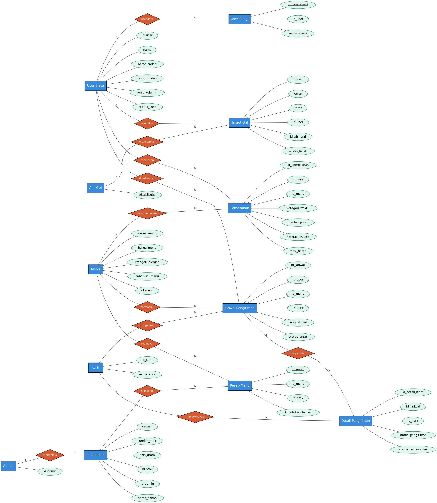
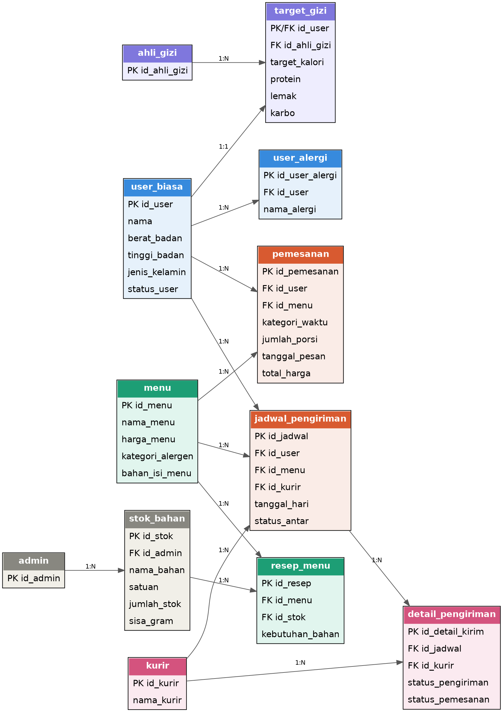

# Healthy Catering Database

Sistem basis data untuk layanan katering diet berlangganan — mengelola profil fisik & target gizi pelanggan, katalog menu, pemesanan otomatis dengan penugasan kurir, pelacakan stok bahan baku, hingga rekap nota dan analisis pemenuhan gizi harian.

Proyek ini fokus pada implementasi **logika bisnis di level database** (stored procedure, trigger, transaction, dan hak akses per-role) — bukan cuma struktur tabel statis.

## Daftar Isi

- [Fitur Utama](#fitur-utama)
- [Struktur Basis Data](#struktur-basis-data)
- [Struktur File](#struktur-file)
- [Instalasi](#instalasi)
- [Alur Bisnis](#alur-bisnis)
- [Stored Procedure](#stored-procedure)
- [Trigger](#trigger)
- [Hak Akses (DCL)](#hak-akses-dcl)
- [Contoh Penggunaan](#contoh-penggunaan)
- [Catatan & Batasan yang Diketahui](#catatan--batasan-yang-diketahui)

## Fitur Utama

- **Kalkulasi gizi otomatis** — target kalori & makro harian dihitung dari data fisik pengguna (berat, tinggi, umur, jenis kelamin) memakai rumus Mifflin-St Jeor.
- **Pemesanan dengan validasi berlapis** — setiap pesanan divalidasi status langganan, riwayat alergi, ketersediaan stok bahan, dan batas kalori harian sebelum disimpan.
- **Penugasan kurir otomatis** — sistem mencari kurir yang tidak sedang bertugas pada tanggal pengiriman yang sama, tanpa perlu input manual.
- **Pengurangan stok otomatis** — stok bahan baku berkurang otomatis setelah pesanan tercatat, termasuk konversi satuan kilogram ↔ gram.
- **Nota & rekap** — nota pelanggan hanya bisa dicetak setelah pesanan benar-benar sampai, plus rekap menu bernilai di atas rata-rata harga untuk kebutuhan staf keuangan.
- **Analisis gizi harian** — status surplus/defisit kalori per hari, serta rekomendasi menu yang aman dari alergen dan sesuai sisa kuota kalori.
- **Kontrol akses berbasis role** — 5 jenis user database dengan hak akses berbeda (admin, kurir, staf gizi, staf dapur, staf keuangan).

## Struktur Basis Data

**Entity Relationship Diagram**



**Relational Schema**



12 tabel, terbagi menjadi 4 kelompok:

| Kelompok | Tabel |
|---|---|
| Pengguna & Gizi | `user_biasa`, `target_gizi`, `user_alergi`, `ahli_gizi` |
| Katalog & Stok | `menu`, `stok_bahan`, `resep_menu`, `admin` |
| Transaksi & Pengiriman | `pemesanan`, `jadwal_pengiriman`, `detail_pengiriman`, `kurir` |

Relasi kunci:
- `user_biasa` 1:1 `target_gizi` — setiap pengguna punya maksimal satu rekam target gizi aktif.
- `user_biasa` 1:N `user_alergi` — satu pengguna bisa punya banyak riwayat alergi.
- `resep_menu` adalah tabel jembatan M:N antara `menu` dan `stok_bahan`, jadi acuan perhitungan kebutuhan bahan per porsi.
- `jadwal_pengiriman.id_pemesanan` menghubungkan eksplisit ke `pemesanan` — memastikan satu jadwal pengiriman selalu bisa ditelusuri balik ke pesanan yang membuatnya.

## Struktur File

```
sql/
├── ddl_catering_sehat.sql                     # struktur tabel (DDL) + seed master data
└── Store_procedure__db_catering_sehat_.sql     # stored procedure, trigger, seed transaksi, DCL
```

## Instalasi

**Kebutuhan:** MySQL 8.0+ atau MariaDB versi setara (dites dengan `sql_mode` termasuk `ONLY_FULL_GROUP_BY`).

1. Jalankan file DDL lebih dulu — ini membuat database, seluruh tabel, dan seed data master (admin, ahli gizi, kurir, menu):
   ```bash
   mysql -u root -p < sql/ddl_catering_sehat.sql
   ```
2. Jalankan file stored procedure & trigger:
   ```bash
   mysql -u root -p < sql/Store_procedure__db_catering_sehat_.sql
   ```
   File ini juga berisi seed data transaksi (riwayat pesanan contoh), pembuatan 5 user database dengan hak akses berbeda, dan blok pengujian di bagian akhir (`call sp_...`).

> Kedua file wajib dijalankan berurutan sesuai urutan di atas — file kedua bergantung pada struktur tabel dari file pertama.

## Alur Bisnis

```
1. Pengguna terdaftar & melengkapi data fisik (berat, tinggi, umur, jenis kelamin)
2. Staf gizi menghitung target gizi          -> sp_hitung_gizi_otomatis
3. Pengguna memesan menu                     -> sp_buat_pesanan_otomatis_kurir
   ├─ divalidasi: status langganan, alergi, stok bahan, batas kalori harian
   └─ kurir yang tersedia ditugaskan otomatis
4. Kurir mengantar, lalu mengonfirmasi selesai -> sp_konfirmasi_makanan_diterima
5. Nota bisa dicetak setelah status "selesai / diterima" -> sp_cek_nota_pelanggan
6. Staf gizi/pengguna memantau pemenuhan gizi harian -> sp_cek_pemenuhan_gizi_harian
7. Rekomendasi menu aman untuk hari ini       -> sp_rekomendasi_menu_aman
```

## Stored Procedure

| Nama | Parameter | Fungsi |
|---|---|---|
| `sp_hitung_gizi_otomatis` | `id_user`, `id_ahli_gizi` | Menghitung & menyimpan target kalori, protein, lemak, karbo harian berdasarkan data fisik pengguna (rumus Mifflin-St Jeor). |
| `sp_buat_pesanan_otomatis_kurir` | `id_user`, `id_menu`, `kategori_waktu`, `jumlah_porsi` | Membuat pesanan baru sekaligus menugaskan kurir dan jadwal pengiriman, dibungkus transaksi (`SERIALIZABLE`) agar aman dari kondisi pesanan bersamaan. |
| `sp_konfirmasi_makanan_diterima` | `id_jadwal` | Mengubah status pengiriman menjadi "selesai / diterima"; menolak konfirmasi ganda dan konfirmasi untuk jadwal di masa depan. |
| `sp_cek_nota_pelanggan` | `id_user` | Menampilkan nota dari seluruh pesanan yang berstatus selesai; menolak jika pengguna belum berlangganan atau belum ada pesanan selesai. |
| `sp_rekap_menu_diatas_rata_rata` | `id_menu` | Merekap riwayat pesanan untuk satu menu tertentu, hanya jika harga menu tersebut di atas rata-rata harga seluruh menu. |
| `sp_cek_pemenuhan_gizi_harian` | `id_user`, `tanggal` | Membandingkan total kalori terjadwal pada suatu tanggal dengan target harian; mengembalikan status kurang/pas/surplus gizi. |
| `sp_rekomendasi_menu_aman` | `id_user` | Merekomendasikan menu yang bebas dari alergen tercatat pengguna dan masih dalam sisa kuota kalori hari ini. |

## Trigger

Seluruh trigger terpasang pada tabel `pemesanan`, berjalan berurutan sesuai daftar di bawah (`trg_cek_status_user` sengaja dibuat pertama agar validasi paling mendasar — langganan aktif — dicek lebih dulu sebelum validasi lain):

| Nama | Waktu | Fungsi |
|---|---|---|
| `trg_cek_status_user` | `BEFORE INSERT` | Menolak transaksi jika pengguna belum berlangganan atau belum punya rekam target gizi. |
| `trg_cek_alergi_insert` | `BEFORE INSERT` | Menolak transaksi jika menu yang dipesan mengandung bahan yang cocok dengan riwayat alergi pengguna. |
| `trg_cek_stok_before_insert` | `BEFORE INSERT` | Menolak transaksi jika stok bahan baku di gudang tidak mencukupi kebutuhan resep menu. |
| `trg_kurangi_stok_bahan` | `AFTER INSERT` | Mengurangi stok bahan baku sesuai resep menu, termasuk konversi otomatis kilogram ↔ gram saat sisa gram menjadi negatif. |

## Hak Akses (DCL)

| User Database | Akses |
|---|---|
| `admin_utama` | Seluruh privilege (`ALL PRIVILEGES`) — pengelolaan penuh sistem. |
| `kurir` | `SELECT` pada `jadwal_pengiriman` & `detail_pengiriman`, `EXECUTE` pada `sp_konfirmasi_makanan_diterima`. Sengaja tanpa hak `UPDATE` langsung, supaya perubahan status wajib lewat prosedur (tidak bisa melewati validasi bisnisnya). |
| `staf_gizi` | `SELECT` data pengguna & alergi, kelola `target_gizi`, `EXECUTE` prosedur terkait gizi. |
| `staf_dapur` | Kelola `menu`, `stok_bahan`, `resep_menu`. |
| `staf_keuangan` | `SELECT` pada `pemesanan` & `user_biasa`, `EXECUTE` prosedur nota & rekap. |

## Contoh Penggunaan

```sql
-- 1. hitung target gizi untuk pengguna id 1, dikonsulkan oleh ahli gizi id 1
call sp_hitung_gizi_otomatis(1, 1);

-- 2. lihat rekomendasi menu yang aman & sesuai sisa kalori hari ini
call sp_rekomendasi_menu_aman(1);

-- 3. buat pesanan: menu id 1, kategori malam, 1 porsi
call sp_buat_pesanan_otomatis_kurir(1, 1, 'malam', 1);

-- 4. kurir konfirmasi pesanan sudah sampai (gunakan id_jadwal hasil langkah 3)
call sp_konfirmasi_makanan_diterima(1);

-- 5. cetak nota
call sp_cek_nota_pelanggan(1);

-- 6. cek pemenuhan gizi hari ini
call sp_cek_pemenuhan_gizi_harian(1, curdate());
```

## Catatan & Batasan yang Diketahui

Beberapa keputusan desain yang disengaja, dan batasan yang masih terbuka untuk pengembangan lanjutan:

- **Deteksi alergen berbasis pencocokan teks (`LIKE`)**, bukan tabel alergen master. Ini cukup untuk kebutuhan proyek ini, tapi rawan tidak mendeteksi sinonim bahan yang tidak disebutkan literal (misal bahan "salmon" tidak otomatis dikenali sebagai "seafood" kecuali kata tersebut ditandai eksplisit di `kategori_alergen`). Menu dengan kandungan seafood/alergen perlu ditandai manual dan konsisten di data.
- **`sp_rekap_menu_diatas_rata_rata` bekerja per satu menu** (menerima `id_menu` sebagai parameter), bukan rekap gabungan seluruh menu di atas rata-rata sekaligus.
- **Kolom `id_kurir` dan `status_antar` di `jadwal_pengiriman` belum aktif dipakai** — informasi kurir yang ditugaskan dan status pengiriman sebenarnya tersimpan di `detail_pengiriman`. Kedua kolom ini disiapkan untuk pengembangan lanjutan.
- **Isolation level `SERIALIZABLE`** dipakai khusus pada transaksi pembuatan pesanan untuk mencegah dua pesanan bersamaan berebut kurir/stok yang sama. Trade-off-nya: potensi lock-wait lebih tinggi saat trafik ramai dibanding isolation level default.
